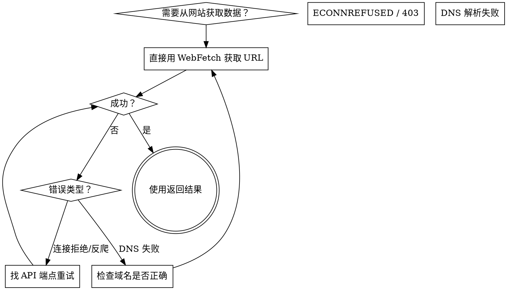

# WebFetch — 获取网页内容

## 概述

WebFetch 获取 URL 内容并用小模型根据 prompt 回答问题。**核心原则：网站会屏蔽爬虫，API 不会。** 遇到 `ECONNREFUSED`、`403`、超时等错误时，第一反应不是放弃或换搜索引擎 — 而是找该网站的 API 端点。

## 何时使用



**适用场景：**
- WebFetch 返回 `ECONNREFUSED` 或 `403 Forbidden`
- 需要从 GitHub、GitLab 等有反爬保护的网站获取数据
- 需要结构化数据而非网页全文

**不适用：**
- 需要登录的网站（WebFetch 不支持认证）
- 需要浏览器渲染的 SPA 页面
- 已经有专用工具（如 `gh` CLI）且已安装

## 核心模式：网站被屏蔽 → 用 API

### Before（失败路径）
```
WebFetch https://github.com/torvalds/linux → ECONNREFUSED
→ WebSearch "linux stars" → 不可靠的第三方数据
→ 试错多次才发现 api.github.com
```

### After（直接路径）
```
WebFetch https://api.github.com/repos/torvalds/linux → 200 OK + 结构化 JSON
```

## 常用 API 端点对照表

| 目标数据 | 网页 URL（通常被屏蔽） | API URL（推荐） |
|----------|----------------------|-----------------|
| GitHub 仓库信息 | `github.com/owner/repo` | `api.github.com/repos/owner/repo` |
| GitHub Issues | `github.com/owner/repo/issues` | `api.github.com/repos/owner/repo/issues` |
| GitHub PRs | `github.com/owner/repo/pulls` | `api.github.com/repos/owner/repo/pulls` |
| GitHub Release | `github.com/owner/repo/releases` | `api.github.com/repos/owner/repo/releases` |
| GitLab 仓库 | `gitlab.com/owner/repo` | `gitlab.com/api/v4/projects/owner%2Frepo` |
| NPM 包信息 | `www.npmjs.com/package/name` | `registry.npmjs.org/name` |
| Reddit 帖子 | `www.reddit.com/r/.../comments/...` | `www.reddit.com/r/.../comments/.../.json` |
| Hacker News | `news.ycombinator.com/item?id=X` | `hacker-news.firebaseio.com/v0/item/X.json` |

**通用规则：** 在 URL 前加 `api.` 子域名，或在 URL 后加 `.json`，很多网站同时支持这两种模式。

## WebFetch 最佳实践

### 1. 优先获取 API（JSON），而非网页（HTML）

WebFetch 的小模型擅长从结构化 JSON 中提取信息，HTML 页面的信噪比低，容易漏掉关键数据。

```bash
# ❌ 差：从 HTML 页面提取，信息不完整
WebFetch https://www.npmjs.com/package/react

# ✅ 好：从 API 获取结构化数据
WebFetch https://registry.npmjs.org/react/latest
```

### 2. prompt 要具体

```bash
# ❌ 模糊
prompt: "这个页面有什么？"

# ✅ 具体
prompt: "这个仓库的 star 数、描述、主语言、最后更新时间是什么？"
```

### 3. 失败时不要跳去 WebSearch

WebSearch 返回的第三方数据不可靠（star 数从 15 万到 23 万不等）。**API 是唯一权威来源。** WebSearch 只应在 API 也不可用时作为最后手段。

### 4. 利用 API 的查询参数

```bash
# 获取 GitHub 仓库最近 5 个 issue
https://api.github.com/repos/owner/repo/issues?per_page=5&state=open&sort=created
```

## WebSearch vs WebFetch

| | WebFetch | WebSearch |
|--|----------|-----------|
| **数据来源** | 指定 URL，权威 | 搜索引擎索引，可能过时 |
| **适合** | 精确数据（star 数、版本号） | 发现性搜索（"哪个库做 X"） |
| **可靠性** | 高（直接从源头） | 中（第三方汇总） |
| **反爬限制** | 有，但 API 可绕过 | 无 |

## 常见错误

| 错误 | 原因 | 修复 |
|------|------|------|
| `ECONNREFUSED` | 网站反爬/防火墙 | 用 API 端点（加 `api.` 前缀） |
| `403 Forbidden` | 反爬虫保护 | 同上，或用 `.json` 后缀 |
| `ENOTFOUND` | DNS 解析失败 | 检查域名拼写，确认网络连通 |
| 超时 | 页面太大 | 用 API 获取子集，加查询参数限制 |
| 内容不完整 | HTML 页面太复杂 | 改用 API 端点获取结构化数据 |
